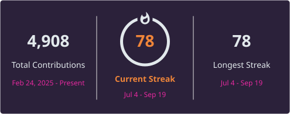

<div align="center">

# Levi Mackay


[](https://levimackay.com/)
[](https://www.linkedin.com/in/levi-mackay-217380396/)
[](https://github.com/levimackay/lydia-cli)

</div>

<br>

```
> whoami
```

- CS student at BYU-Idaho, 3.98 GPA, graduating December 2027
- Building **Main Street Sites** inside the **Sandbox** startup accelerator, and TA'ing for the CS department
- Maintain **Lydia**, an open source local AI coding agent, with merged pull requests from developers I have never met
- Currently learning Swift from the ground up, writing every line by hand
- Applying for **Summer 2027** software engineering internships

<br>

```
> tech.stack
```

**Languages**
<hr>


**Frameworks & Tools**
<hr>


[](https://developer.apple.com/xcode/)
[](https://ollama.com)
[](https://tailscale.com)

<br>

```
> currently.working_on()
```

```json
{
  "learning":  "Swift from zero, 14 chapters, every line written by hand",
  "next":      "a computer vision app on Apple's Vision framework",
  "prepping":  "data structures and algorithms for Summer 2027 internships"
}
```

<br>

```
> featured.project
```

### [PreCheck AI](https://github.com/levimackay/PrecheckAI)

A pre-AI checklist gate for coding practice. Before you ask an assistant for help, you have to prove in writing that you actually tried the problem yourself. Live validation, auto-assembled hint prompts, and local streak tracking.

[](https://github.com/levimackay/PrecheckAI/stargazers)
[](https://github.com/levimackay/PrecheckAI/blob/main/LICENSE)
[](https://github.com/levimackay/PrecheckAI)

<br>

```
> pinned.projects
```

| Project | Description | Stack |
|---|---|---|
| [AIR (AI Router)](https://github.com/levimackay/air) | Load balancer for AI coding agent CLIs. Picks the best available agent, monitors it, checkpoints progress, and switches providers on failure or rate limit without losing work | `Go` `Cobra` `Bubble Tea` |
| [Lydia](https://github.com/levimackay/lydia-cli) | Local AI coding agent for the terminal. Reads and edits code, runs commands, and drives git through a local Ollama model. No API keys, nothing leaves the machine | `Python` `Ollama` |
| [SecurityScanner](https://github.com/levimackay/SecurityScanner) | CLI that scans a source file for vulnerabilities with the Gemini API, then prints findings sorted by severity and color coded in the terminal | `Python` `Gemini API` |
| [PrecheckAI](https://github.com/levimackay/PrecheckAI) | A gate that makes you write down what you tried before an AI will help. One HTML file, zero dependencies | `JavaScript` `HTML` |
| [C# DSA Academy](https://github.com/levimackay/csharp-dsa-academy) | Data structures and algorithms in C#. 12 offline first .NET modules, each a stub plus an xUnit suite that defines done, worked through module by module | `C#` `.NET` `xUnit` |
| [Swift Academy](https://github.com/levimackay/swift-academy) | A 14 chapter Swift curriculum I built for myself. Every exercise ships as a stub plus a failing test, and I type every line | `Swift` `SwiftPM` |

<br>

```
> github.stats
```

<div align="center">



</div>

<br>

```
> contact.init()
```

```json
{
  "github":    "github.com/levimackay",
  "linkedin":  "linkedin.com/in/levi-mackay-217380396",
  "portfolio": "levimackay.com",
  "status":    "open to Summer 2027 SWE internships"
}
```

<div align="center">

**"Let's build something real."**

</div>

---
**Last updated:** 2026-08-13 14:59 MDT

---

Maintained by [Levi Mackay](https://github.com/levimackay)
